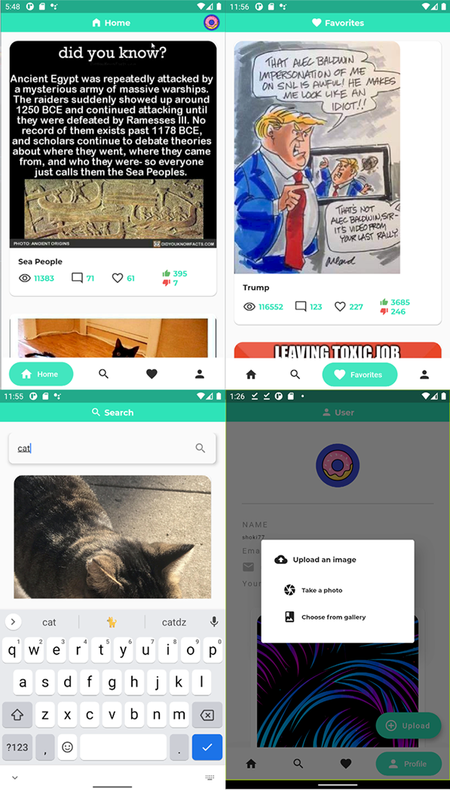

# imgur-client 

This project is a simple integration of the [**Imgur api**](https://apidocs.imgur.com/) in Flutter.  
It was a school project at the very beginning but I decided to improve it.
It is also my first mobile app.

## Configure API credentials

Before all, you must fill the informations in `lib/env.dart` :  

```dart
const api = {
	'clientID': 'imgur client id',
	'clientSecret': 'imgur client secret',
	'responseType': 'token',
	'state': 'imgur-client',
};
```
This will allow queries to the Imgur api to work properly.  

## How to run

Install flutter on your system and then run :

```flutter run```

## Features

- ✅ OAuth with Imgur API
- ✅ Homescreen with trending images (like/view count)
- ✅ Search images
- ✅ Like/Dislke images
- ✅ Profil informations
- ✅ Upload/View images

## Preview


